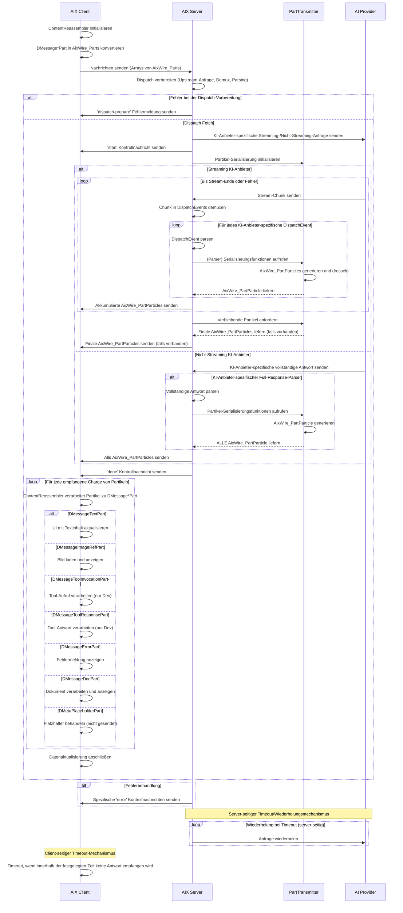

# AIX

AIX ist eine Client/Server-Bibliothek zur Integration fortschrittlicher KI-Funktionen in Webanwendungen.

## Überblick

AIX ermöglicht Echtzeit-, typensichere Kommunikation zwischen einer Typescript-Anwendung und KI-Anbietern.

Mit tRPC aufgebaut, verwaltet es den Lebenszyklus von KI-generierten Inhalten von der Anfrage bis zur Darstellung und unterstützt sowohl Streaming- als auch Nicht-Streaming-KI-Anbieter.

## Funktionen

- Inhaltserstellung
  - Multi-Modal Streaming/Nicht-Streaming
  - Gedrosselte Batch-Verarbeitung und Fehlerbehandlung
  - Server-seitiges Timeout/Wiederholung
- Funktionsaufrufe und Code-Ausführung
- Komplexe KI-Workflows (zukünftig)
- Embeddings / Informationsabruf / Bildbearbeitung (zukünftig)

## AIX Anbieter-Unterstützung

| Service    | Chat       | Funktionsaufrufe | Multi-Modale Eingabe | Fortsetzung (1) | Streaming | Eigenheiten |
|------------|------------|------------------|-------------------|-----------|-----------|---------------|
| Alibaba    | ✅          | ✅                |                   | ✅         | Ja + 📦  |               |
| Anthropic  | ✅          | ✅ + Parallel     | Bild: ✅            | ✅         | Ja + 📦  |               |
| Azure      | ✅          | ✅                |                   | ✅         | Ja + 📦  |               |
| Deepseek   | ✅          | ❌ (abgelehnt)     |                   | ✅         | Ja + 📦  |               |
| Gemini     | ✅          | ✅ + Parallel     | Bild: ✅            | ✅         | Ja + 📦  | Code-Ausf.: ✅   |
| Groq       | ✅          | ✅ + Parallel     |                   | ✅         | Ja + 📦  |               |
| LM Studio  | ✅          | ❌ (funktioniert nicht)  |                   | ❌         | Ja  + 📦 |               |
| Local AI   | ✅          | ✅                |                   | ❌         | Ja  + 📦 |               |
| Mistral    | ✅          | ✅                |                   | ✅         | Ja  + 📦 |               |
| OpenAI     | ✅          | ✅ + Parallel     | Bild: ✅            | ✅         | Ja + 📦  |               |
| OpenPipe   | ✅          | ✅                | Bild: ✅            | ✅         | Ja + 📦  |               |
| OpenRouter | ✅          | ❌ (inkonsistent) |                   | ✅         | Ja + 📦  |               |
| Perplexity | ✅          | ❌ (abgelehnt)     |                   | ✅         | Ja + 📦  |               |
| TogetherAI | ✅          | ✅                |                   | ✅         | Ja + 📦  |               |
| xAI        |            |                  |                   |           |           |               |
| Ollama (2) | ❌ (kaputt) | ?                |                   |           |           |               |

Anmerkungen:

- 1: Fortsetzungsmarkierungen: a. sendet reason=max-tokens (Streaming/Nicht-Streaming), b. TBA
- 2: Ollama wurde aufgrund der benutzerdefinierten APIs noch nicht auf AIX portiert.

## 1. Systemarchitektur

Das Subsystem besteht aus drei Hauptkomponenten:

### **Client (z.B. Next.js Frontend)**

- Initiiert Anfragen
- Rendert KI-generierte Inhalte in Echtzeit
- Rekonstruiert gestreamte Daten

### **Server (z.B. Next.js Backend)**

- Fungiert als Vermittler zwischen Client und KI-Anbietern
- Handhabt die Vorbereitung, Weiterleitung und Verarbeitung von Anfragen
- Streamt Antworten zurück an den Client

### **Upstream KI-Anbieter**

- Generieren KI-Inhalte basierend auf Anfragen

### ChatGenerate Workflow

1. Anfrage-Initialisierung: AIX Client bereitet Anfrage vor und sendet sie (systemInstruction, messages=AixWire_Parts[], etc.) an den AIX Server
2. Dispatch-Vorbereitung: AIX Server bereitet sich auf die Upstream-Kommunikation vor
3. Interaktion mit KI-Anbieter: AIX Server kommuniziert mit dem KI-Anbieter (Streaming oder Nicht-Streaming)
4. Daten-Dekodierung, Transformation und Übertragung: AIX Server sendet AixWire_Particles an den AIX Client
5. Client-seitige Verarbeitung: Der ContentReassembler des Clients verarbeitet AixWire_Particles zu einer Liste (wahrscheinlich einer einzigen) von Nachrichten mit mehreren Fragmenten (DMessageContentFragment[])
6. Abschluss: AIX Server sendet 'done' Kontrollnachricht, AIX Client schließt die Datenaktualisierung ab
7. Fehlerbehandlung: AIX Server sendet bei Bedarf spezifische Fehlermeldungen

### Dateien und Ordner

AIX ist in die folgenden Dateien und Ordner gegliedert:

1. Client-Seite (`/client/`):

- `aix.client.ts`: Haupt-Client-seitiger Einstiegspunkt für AIX-Operationen.
- `aix.client.chatGenerateRequest.ts`: Handhabt die Konvertierung von Chat-Nachrichten in ein AIX-kompatibles Format (AixWire_Content, AixWire_Parts, etc.).

1. Server-Seite (`/server/`):

- API (`/server/api/`) - Client-zu-Server-Kommunikation:
  - `aix.router.ts`: Definiert den tRPC-Router für AIX-Operationen.
  - `aix.wiretypes.ts`: Enthält Zod-Schemas für Typen und Aufrufe, die vom Client eingehen (AixWire_Parts, AixWire_Content, AixWire_Tooling, AixWire_API, ...), und ausgehen (AixWire_Particles)

- Dispatch (`/server/dispatch/`) - Server-zu-KI-Anbieter-Kommunikation:
  - `/server/dispatch/chatGenerate/`: Inhaltserstellung mit Chat-ähnlichen Eingaben:
    - `./adapters/`: Adapter zur Erstellung von API-Anfragen für verschiedene KI-Protokolle (Anthropic, Gemini, OpenAI).
    - `./parsers/`: Parser zur Verarbeitung von Streaming-/Nicht-Streaming-Antworten von verschiedenen KI-Protokollen (dieselbe 3).
    - `chatGenerate.dispatch.ts`: Erstellt eine Pipeline zur Ausführung der Chat-Generierung an einen bestimmten Anbieter.
    - `ChatGenerateTransmitter.ts`: Wird verwendet, um AixWire_Particles zu serialisieren und an den Client zu übertragen.
  - `/server/dispatch/wiretypes/`: KI-Anbieter Wire Types:
    - Typdefinitionen für verschiedene KI-Anbieter/Protokolle (Anthropic, Gemini, OpenAI).
  - `stream.demuxers.ts`: Handhabt das Demuxing verschiedener Stream-Formate.

## 3. Architekturdiagramm

---

### 2025-03-14 Update

AIX wird in FlowHero produktiv eingesetzt und ist stabil und performant.
Der Code ist eng mit dem tRPC-Framework und dem Rest unserer Codebasis gekoppelt,
daher wird die Verwendung außerhalb unseres Ökosystems nicht empfohlen.

Für eine großartige Typescript-Alternative empfehlen wir das Vercel AI SDK.
